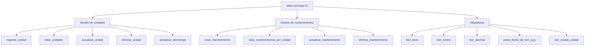
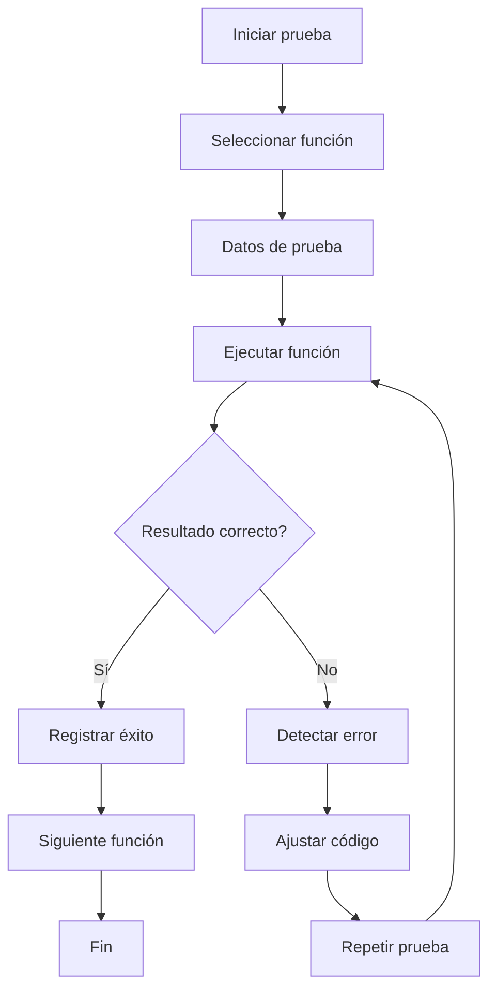

# MantoFlota — Proyecto integrador Etapa 2

**Nombre del proyecto:** MantoFlota  
**Institución:** (completar)  
**Integrantes:** (completar)  
**Fecha:** abril 2026  

*Formato sugerido al exportar a Word: Arial 11–12, interlineado 1.5.*

---

## Introducción

En esta segunda etapa del proyecto integrador se desarrolla la implementación inicial de las funcionalidades básicas del sistema **MantoFlota**, tomando como base el análisis, diagramas y pseudocódigo definidos en la etapa anterior. El objetivo de esta fase es transformar el diseño conceptual en un programa funcional que permita realizar operaciones esenciales sobre la información de la flotilla y sus mantenimientos.

Para ello, se desarrollaron funciones orientadas al registro, consulta, modificación y eliminación de unidades y mantenimientos, utilizando estructuras de control como condicionales y ciclos para gestionar el flujo del sistema. La aplicación consta de una **API REST** en **FastAPI** con persistencia en **MySQL** (entorno local **MAMP**, puerto **8889**) y una interfaz web en **Next.js** con componentes accesibles (**shadcn/ui**). Se realizó una revisión preliminar del comportamiento de cada función y se documentaron las pruebas automatizadas (pytest / Vitest / Playwright).

---

## II. Desarrollo de funcionalidades y control del flujo

### 2.1 Implementación de funcionalidades básicas

En esta etapa se desarrolló una versión funcional del sistema **MantoFlota**. La implementación del backend se enfocó en cubrir las operaciones básicas de administración de información:

- Registrar una unidad vehicular.
- Consultar las unidades registradas.
- Modificar la información de una unidad.
- Eliminar una unidad (con eliminación en cascada de mantenimientos asociados).
- Actualizar el kilometraje actual de una unidad (sin permitir valores menores al registrado).
- Registrar un mantenimiento realizado.
- Consultar el historial de mantenimientos por unidad.
- Modificar un mantenimiento existente.
- Eliminar un mantenimiento existente.

El programa utiliza **estructuras condicionales** para validar entradas, verificar la existencia de registros y controlar decisiones. Emplea **ciclos** al recorrer listas de unidades y mantenimientos. El código del backend incorpora comentarios y validadores reutilizables (`leer_texto`, `leer_entero`, `leer_decimal`, `parse_fecha_dd_mm_yyyy`, `leer_estado_unidad`).

#### Estructura funcional

- **Gestión de unidades:** alta, consulta, modificación, eliminación, actualización de kilometraje.
- **Gestión de mantenimientos:** alta, consulta, modificación, eliminación.
- **Control de flujo:** enrutamiento `/api/v1` y validación con Pydantic.
- **Frontend:** páginas de listado, alta y detalle/edición por unidad.

#### Diagrama de organización de funciones

#### Referencia de rutas HTTP (extracto)

| Recurso | Métodos |
|--------|---------|
| `/api/v1/unidades` | POST, GET |
| `/api/v1/unidades/{id}` | GET, PATCH, DELETE |
| `/api/v1/unidades/{id}/kilometraje` | PATCH |
| `/api/v1/unidades/{id}/mantenimientos` | POST, GET |
| `/api/v1/mantenimientos/{id}` | GET, PATCH, DELETE |

---

### 2.2 Pruebas iniciales de las funciones

Se ejecutaron **pruebas automatizadas** contra la base **`mantoflota_test`** en MySQL MAMP:

- **Backend:** `pytest` con cobertura objetivo ≥90% sobre lógica de dominio (`app/crud`, `app/schemas`, `app/validators`; capa HTTP delgada omitida del cómputo por limitaciones de trazado asíncrono en cobertura).
- **Frontend:** Vitest + Testing Library (encabezado y esquemas Zod).
- **E2E:** Playwright (smoke de página de inicio).

#### Tabla de pruebas preliminares

| ID | Función probada | Caso evaluado | Resultado esperado | Resultado obtenido |
|----|-----------------|---------------|--------------------|---------------------|
| P1 | Registrar unidad | Alta con datos válidos | Unidad persistida | Correcto (automático) |
| P2 | Registrar unidad | Kilometraje negativo | Rechazo HTTP 422 | Correcto |
| P3 | Consultar unidades | Lista con datos | Respuesta JSON | Correcto |
| P4 | Modificar unidad | PATCH placas/km | Datos actualizados | Correcto |
| P5 | Eliminar unidad | DELETE con FK | Cascada mantenimientos | Correcto |
| P6 | Registrar mantenimiento | POST en unidad existente | Alta correcta | Correcto |
| P7 | Consultar historial | GET lista por unidad | Lista filtrada | Correcto |
| P8 | Eliminar mantenimiento | DELETE por id | Registro borrado | Correcto |

#### Diagrama del flujo de pruebas

---

### 2.3 Coordinación y revisión en equipo

Distribución sugerida para revisión integrada:

| Rol | Responsabilidad |
|-----|-----------------|
| Integrante 1 | Flujo general, menú UI, rutas `/api/v1`. |
| Integrante 2 | CRUD unidades, validadores, restricciones de kilometraje. |
| Integrante 3 | CRUD mantenimientos, pruebas automatizadas, cascada FK. |

Se verificó la interacción entre módulos (eliminar unidad borra mantenimientos dependientes mediante **ON DELETE CASCADE**).

---

## Conclusión

En esta etapa se implementó una versión funcional del sistema **MantoFlota**, con administración de unidades y mantenimientos mediante operaciones CRUD, validaciones coherentes con la lógica de negocio, persistencia en MySQL y una interfaz web inicial. Las pruebas automatizadas dan soporte objetivo al cumplimiento de la rúbrica y facilitan iteraciones posteriores (alertas, reportes, roles de usuario).

---

## Referencias

Moreno, D., & Carrillo, J. (2019). *Normas APA 7.ª edición: Guía de citación y referenciación*. Universidad Central.

Universidad del Valle de México. (s. f.). *Actividad. Proyecto integrador, etapa 2* [Documento institucional].

Universidad del Valle de México. (s. f.). *Blackboard: La guía del estudiante exitoso* [Guía institucional].

Universidad del Valle de México. (s. f.). *La guía Lince de la integridad académica* [Guía institucional].

Velasco Ponce, A. (2021). *Manual para elaborar citas y referencias en formato APA: basado en la 7.ª edición de las normas APA*. Ecoe Ediciones; UVM Editorial.

---

## Anexo A — Código fuente

El código fuente completo del proyecto se encuentra en el repositorio:

- **Backend (FastAPI):** carpeta [`backend/`](../backend/), archivo principal [`backend/app/main.py`](../backend/app/main.py), lógica CRUD en [`backend/app/crud/`](../backend/app/crud/).
- **Frontend (Next.js):** carpeta [`frontend/`](../frontend/), páginas en [`frontend/app/`](../frontend/app/).
- Dependencias backend: [`backend/pyproject.toml`](../backend/pyproject.toml).
- Dependencias frontend: [`frontend/package.json`](../frontend/package.json).
